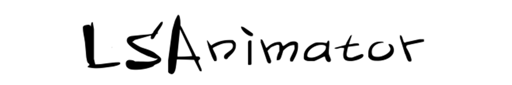
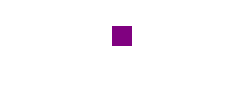

# Introduction（中文介绍在下面）

# LSAnimator

Easy to read and write non-invasive multi-chain animation framework, it is inspired by JHChainableAnimations.

I think JHChainableAnimations uses the concept of DSL (Domain Specific Language). It translation the official complex animation API (including UIView and CACoreAnimation) into their own DSL language. This make it seem to be streamlined and efficient in dealing with animations, so I have kept all of its advantages as a single-chain animation framework as much as possible.

But it's shortcomings as a single-chain animation framework is also obvious. JHChainableAnimations is more powerless when the animation interaction is a bit more complicated. If there are multiple animations Which are independent of each other, JHChainableAnimations can not complete the task.

### Features
- [x] **Multi-chain Animation**
- [x] **Non-intrusive**

The following comparison of single-chain animation and multi-chain animation differences:

#### Single-chain animation

| code | animation |
| ---- | --------- |
| `_animatorView.ls_moveX(80).ls_animate(1);` |  |
| `_animatorView.ls_increWidth(20).ls_bounce.ls_animateWithRepeat(0.5, 3);` |  |
| `_animatorView.ls_scale(2).ls_background([UIColor orangeColor]).ls_cornerRadius(20).ls_thenAfter(0.5).ls_moveY(40).ls_bounce.ls_animate(0.5);` |  |

You may have noticed that in the third single-chain animation above, the animation that changed the background color and the animated size are placed in the same node as the chain. 

If your company's animation interaction designer requires the animation that changed the background color independent of the other animations. So sorry to tell you that single-chain animation can not Complete the requirements.

So I was done on the basis of JHChainableAnimations multi-chain animation framework LSAnimator.

#### Multi-chain animation


``` objc
_animatorView.ls_scale(2).ls_cornerRadius(20).ls_thenAfter(0.5).ls_moveY(40).ls_bounce.ls_animate(0.5);

_animatorView.ls_concurrent.ls_background([UIColor orangeColor]).ls_delay(0.25).ls_animate(0.8);
```

As shown above, you can see the animation to change the background color throughout the whole animation and it is independent of other animations.

# Install

### CocoaPods

1. Add `pod 'LSAnimator'` to Podfile
2. Execute `pod install` or` pod update`
3. Import `<LSAnimator / LSAnimator.h>`

### Manual installation

1. Download all files in the LSAnimator folder
2. Add (drag and drop) the source file to your project
3. Import the corresponding header file `UIView + LSAnimator.h`

# Usage

Non-intrusive integration, directly in the animation you want to add the effect of `UIView` above the following API can be written animation.

### Multi-chain animation properties

#### Sets the animation of the target value

| property name | params | usage |
| --- | :---: | --- |
| ls_frame | `CGRect` | `view.ls_frame(rect)` |
| ls_bounds | `CGRect` | `view.ls_bounds(rect)` |
| ls_size | `CGSize` | `view.ls_size(size)` |
| ls_origin | `CGPoint` | `view.ls_origin(point)` |
| ls_center | `CGPoint` | `view.ls_center(point)` |
| ls_x | `CGFloat` | `view.ls_x(float)` |
| ls_y | `CGFloat` | `view.ls_y(float)` |
| ls_width | `CGFloat` | `view.ls_width(float)` |
| ls_height | `CGFloat` | `view.ls_height(float)` |
| ls_opacity | `CGFloat` | `view.ls_opacity(float)` |
| ls_background | `UIColor` | `view.ls_background(color)` |
| ls_borderColor | `UIColor` | `view.ls_borderColor(color)` |
| ls_borderWidth | `CGFloat ` | `view.ls_borderWidth(float)` |
| ls_cornerRadius | `CGFloat ` | `view.ls_cornerRadius(float)` |
| ls_scale | `CGFloat ` | `view.ls_scale(float)` |
| ls_scaleX | `CGFloat ` | `view.ls_scaleX(float)` |
| ls_scaleY | `CGFloat ` | `view.ls_scaleY(float)` |
| ls_anchor | `CGPoint ` | `view.ls_anchor(point)` |

#### Incremental animation

| property name | params | usage |
| --- | :---: | --- |
| ls_moveX | `CGFloat` | `view.ls_moveX(float)` |
| ls_moveY | `CGFloat` | `view.ls_moveY(float)` |
| ls_moveXY | `CGPoint` | `view.ls_moveXY(point)` |
| ls_movePolar | `CGFloat，CGFloat` | `view.ls_movePolar(radius, angle)` |
| ls_increWidth | `CGFloat` | `view.ls_increWidth(float)` |
| ls_increHeight | `CGFloat` | `view.ls_increHeight(float)` |
| ls_increSize | `CGSize` | `view. ls_increSize(size)` |

#### Transform animation

| property name | params | usage |
| --- | :---: | --- |
| ls_transformIdentity | --- | `view.ls_transformIdentity ` |
| ls_rotate | `CGFloat` | `view.ls_rotate(float) ` |
| ls_rotateX | `CGFloat` | `view.ls_rotateX(float) ` |
| ls_rotateY | `CGFloat` | `view.ls_rotateY(float) ` |
| ls_rotateZ | `CGFloat` | `view.ls_rotateZ(float) ` |
| ls_transformX | `CGFloat` | `view.ls_transformX(float) ` |
| ls_transformY | `CGFloat` | `view.ls_transformY(float) ` |
| ls_transformZ | `CGFloat` | `view.ls_transformZ(float) ` |
| ls_transformXY | `CGPoint` | `view.ls_transformXY(point) ` |
| ls_transformScaleX | `CGFloat` | `view.ls_transformScaleX(float) ` |
| ls_transformScaleY | `CGFloat` | `view.ls_transformScaleY(float) ` |
| ls_transformScale | `CGFloat` | `view.ls_transformScale(float) ` |

#### BezierPath

| property name | params | usage |
| --- | --- | --- |
| ls_moveOnPath | `UIBezierPath` | `view.ls_moveOnPath(path) ` |
| ls_moveAndRotateOnPath | `UIBezierPath` | `view.ls_moveAndRotateOnPath(path) ` |
| ls_moveAndReverseRotateOnPath | `UIBezierPath` | `view.ls_moveAndReverseRotateOnPath(path) ` |

#### AnchorPoint

| property name | params | usage |
| --- | :---: | --- |
| ls_anchorDefault | --- | `view.ls_anchorDefault` |
| ls_anchorCenter | --- | `view.ls_anchorCenter` |
| ls_anchorTop | --- | `view.ls_anchorTop` |
| ls_anchorBottom | --- | `view.ls_anchorBottom` |
| ls_anchorLeft | --- | `view.ls_anchorLeft` |
| ls_anchorRight | --- | `view.ls_anchorRight` |
| ls_anchorTopLeft | --- | `view.ls_anchorTopLeft` |
| ls_anchorTopRight | --- | `view.ls_anchorTopRight` |
| ls_anchorBottomLeft | --- | `view.ls_anchorBottomLeft` |
| ls_anchorBottomRight | --- | `view.ls_anchorBottomRight` |

#### Animation curve


| property name | params | usage |
| --- | :---: | --- |
| ls_easeIn | --- | `view.ls_easeIn` |
| ls_easeOut | --- | `view.ls_easeOut` |
| ls_easeInOut | --- | `view.ls_easeInOut` |
| ls_easeBack | --- | `view.ls_easeBack` |
| ls_spring | --- | `view.ls_spring` |
| ls_bounce | --- | `view.ls_bounce` |
| ls_easeInQuad | --- | `view.ls_easeInQuad` |
| ls_easeOutQuad | --- | `view.ls_easeOutQuad` |
| ls_easeInOutQuad | --- | `view.ls_easeInOutQuad` |
| ls_easeInCubic | --- | `view.ls_easeInCubic` |
| ls_easeOutCubic | --- | `view.ls_easeOutCubic` |
| ls_easeInOutCubic | --- | `view.ls_easeInOutCubic` |
| ls_easeInQuart | --- | `view.ls_easeInQuart` |
| ls_easeOutQuart | --- | `view.ls_easeOutQuart` |
| ls_easeInOutQuart | --- | `view.ls_easeInOutQuart` |
| ls_easeInSine | --- | `view.ls_easeInSine` |
| ls_easeOutSine | --- | `view.ls_easeOutSine` |
| ls_easeInOutSine | --- | `view.ls_easeInOutSine` |
| ls_easeInExpo | --- | `view.ls_easeInExpo` |
| ls_easeOutExpo | --- | `view.ls_easeOutExpo` |
| ls_easeInOutExpo | --- | `view.ls_easeInOutExpo` |
| ls_easeInCirc | --- | `view.ls_easeInCirc` |
| ls_easeOutCirc | --- | `view.ls_easeOutCirc` |
| ls_easeInOutCirc | --- | `view.ls_easeInOutCirc` |
| ls_easeInElastic | --- | `view.ls_easeInElastic` |
| ls_easeOutElastic | --- | `view.ls_easeOutElastic` |
| ls_easeInOutElastic | --- | `view.ls_easeInOutElastic` |
| ls_easeInBack | --- | `view.ls_easeInBack` |
| ls_easeOutBack | --- | `view.ls_easeOutBack` |
| ls_easeInOutBack | --- | `view.ls_easeInOutBack` |
| ls_easeInBounce | --- | `view.ls_easeInBounce` |
| ls_easeOutBounce | --- | `view.ls_easeOutBounce` |
| ls_easeInOutBounce | --- | `view.ls_easeInOutBounce` |

#### Hooks

| property name | params | usage |
| --- | :---: | --- |
| ls_preAnimationBlock | `Block` | `view.ls_preAnimationBlock(block)` |
| ls_postAnimationBlock | `Block ` | `view.ls_postAnimationBlock(block)` |
| ls_theFinalCompletion | `Block ` | `view.ls_theFinalCompletion(block)` |

#### Delay

| property name | params | usage |
| --- | :---: | --- |
| ls_delay | `NSTimeInterval` | `view.ls_delay(time)` |
| ls_wait | `NSTimeInterval` | `view.ls_wait(time)` |

#### Animator Controller

| property name | params | usage |
| --- | :---: | --- |
| ls_repeat | `NSTimeInterval, NSInteger` | `view.ls_repeat(time, count)` |
| ls_thenAfter | `NSTimeInterval` | `view.ls_thenAfter(time)` |
| ls_animate | `NSTimeInterval` | `view.ls_animate(time)` |
| ls_animateWithRepeat | `NSTimeInterval, NSInteger` | `view. ls_animateWithRepeat(time, count)` |
| ls_animateWithCompletion | `NSTimeInterval, Block` | `view.ls_animateWithCompletion(time, block)` |

# System Requirements

Currently supports iOS 7.0 (including 7.0).

# License

LSAnimator uses the MIT license, see the LICENSE file for details.

# Contributors

If you think LSAnimator is worthy of attention and want to become a contributor, you may wish to join us.

LSAnimator core member group (QQ group): 163013540

# ContactInfo

If you have any ideas and suggestions about LSAnimator, please to send me an E-mail, and I will reply you as soon as possible within 24 hours.

My E-mail address: lisionmail@gmail.com


# 中文介绍

# LSAnimator 动画师

易于阅读和写入的非侵入式可多链式动画框架，灵感来源于 JHChainableAnimations。

在我初尝 JHChainableAnimations 链式动画框架时对它的感觉非常赞，我认为它使用了 DSL(Domain Specific Language) 的概念，将官方繁杂的动画 API (包含 UIView 和 CACoreAnimation) 转为了自己的 DSL 语言。这使得它在处理动画这一指定领域变得精简而高效，所以我尽可能的保留了其作为单链动画的所有优点。不过其作为单链式动画框架的缺点也是显而易见的，当动画交互稍微复杂，存在多个动画相互独立（某些动画之间有先后次序可以放入一个动画链而某些独立其外）时 JHChainableAnimations 就显得比较无力了。

### 新特性
- [x] **多链式动画**
- [x] **非侵入式**

下面对比一下单链式动画和多链式动画的差异：

#### 单链式动画

| 代码 | 动画效果 |
| ---- | --------- |
| `_animatorView.ls_moveX(80).ls_animate(1);` |  |
| `_animatorView.ls_increWidth(20).ls_bounce.ls_animateWithRepeat(0.5, 3);` |  |
| `_animatorView.ls_scale(2).ls_background([UIColor orangeColor]).ls_cornerRadius(20).ls_thenAfter(0.5).ls_moveY(40).ls_bounce.ls_animate(0.5);` |  |

你或许已经注意到，在上面第三个单链式动画中，改变背景颜色的动画与改变大小的动画被放入了链条的同一节点。如果你所在公司的动画交互设计师让你在改变大小之后的若干时间才开始改变颜色，且改变颜色的时长独立于大小和位移的动画链，那么很遗憾的告诉你，单链式动画无法实现上述的动画交互效果。

所以我才在 JHChainableAnimations 的基础上做了多链式动画框架 LSAnimator。

#### 多链式动画


``` objc
_animatorView.ls_scale(2).ls_cornerRadius(20).ls_thenAfter(0.5).ls_moveY(40).ls_bounce.ls_animate(0.5);
_animatorView.ls_concurrent.ls_background([UIColor orangeColor]).ls_delay(0.25).ls_animate(0.8);
```

如上所示，可以把逻辑上不相关的动画（上面例子是改变颜色的动画）独立出来放到另一个动画链去执行，以实现复杂的动画交互需求。

# [这里还有一篇 LSAnimator 对比 JHChainableAnimations 的文章推荐阅读](http://blog-lision.com/2017/05/04/LSAnimatorVSJHChainableAnimations/)

# 安装

### CocoaPods

1. 在 Podfile 中添加 `pod 'LSAnimator'`
2. 执行 `pod install` 或者 `pod update`
3. 导入 `<LSAnimator/LSAnimator.h>`

### 手动安装

1. 下载 LSAnimator 文件夹中的所有文件
2. 将源文件添加（拖放）到你的工程
3. 导入对应头文件 `UIView+LSAnimator.h`

# 用法

非侵入性集成，直接在你所要添加动画效果的 `UIView` 上面按照下述 API 书写动画即可。

### 多链式动画属性

#### 设置目标值的动画

| 属性名称 | 参数 | 用法 | 描述 |
| --- | :---: | --- | --- |
| ls_frame | `CGRect` | `view.ls_frame(rect)` | 在当前节点添加设置 frame 的动画 |
| ls_bounds | `CGRect` | `view.ls_bounds(rect)` | 在当前节点添加设置 bounds 的动画 |
| ls_size | `CGSize` | `view.ls_size(size)` | 在当前节点添加设置 bounds.size 的动画 |
| ls_origin | `CGPoint` | `view.ls_origin(point)` | 在当前节点添加设置 frame.origin 的动画 |
| ls_center | `CGPoint` | `view.ls_center(point)` | 在当前节点添加设置 center 的动画 |
| ls_x | `CGFloat` | `view.ls_x(float)` | 在当前节点添加设置 frame.origin.x 的动画 |
| ls_y | `CGFloat` | `view.ls_y(float)` | 在当前节点添加设置 frame.origin.y 的动画 |
| ls_width | `CGFloat` | `view.ls_width(float)` | 在当前节点添加设置 bounds.size.with 的动画 |
| ls_height | `CGFloat` | `view.ls_height(float)` | 在当前节点添加设置 bounds.size.height 的动画 |
| ls_opacity | `CGFloat` | `view.ls_opacity(float)` | 在当前节点添加设置透明度的动画 |
| ls_background | `UIColor` | `view.ls_background(color)` | 在当前节点添加设置 backgroundColor 的动画 |
| ls_borderColor | `UIColor` | `view.ls_borderColor(color)` | 在当前节点添加设置 layer.borderColor 的动画 |
| ls_borderWidth | `CGFloat ` | `view.ls_borderWidth(float)` | 在当前节点添加设置 layer.borderWidth 的动画 |
| ls_cornerRadius | `CGFloat ` | `view.ls_cornerRadius(float)` | 在当前节点添加设置 layer.cornerRadius 的动画 |
| ls_scale | `CGFloat ` | `view.ls_scale(float)` | 在当前节点添加设置 bounds.size 的倍数动画 |
| ls_scaleX | `CGFloat ` | `view.ls_scaleX(float)` | 在当前节点添加设置 bounds.size.width 的倍数动画 |
| ls_scaleY | `CGFloat ` | `view.ls_scaleY(float)` | 在当前节点添加设置 bounds.size.height 的倍数动画 |
| ls_anchor | `CGPoint ` | `view.ls_anchor(point)` | 在当前节点动画之前设置 layer.anchorPoint |

#### 增量动画

| 属性名称 | 参数 | 用法 | 描述 |
| --- | :---: | --- | --- |
| ls_moveX | `CGFloat` | `view.ls_moveX(float)` | 在当前节点添加 x 轴位移 float 的动画 |
| ls_moveY | `CGFloat` | `view.ls_moveY(float)` | 在当前节点添加 y 轴位移 float 的动画 |
| ls_moveXY | `CGPoint` | `view.ls_moveXY(point)` | 上述动画合并 |
| ls_movePolar | `CGFloat，CGFloat` | `view.ls_movePolar(radius, angle)` | 一般用作波浪位移动画 |
| ls_increWidth | `CGFloat` | `view.ls_increWidth(float)` | 在当前节点添加 bounds.size.width 增量动画 |
| ls_increHeight | `CGFloat` | `view.ls_increHeight(float)` | 在当前节点添加 bounds.size.height 增量动画 |
| ls_increSize | `CGSize` | `view. ls_increSize(size)` | 在当前节点添加 bounds.size 增量动画 |

#### 转换动画

| 属性名称 | 参数 | 用法 |
| --- | :---: | --- |
| ls_transformIdentity | --- | `view.ls_transformIdentity ` |
| ls_rotate | `CGFloat` | `view.ls_rotate(float) ` |
| ls_rotateX | `CGFloat` | `view.ls_rotateX(float) ` |
| ls_rotateY | `CGFloat` | `view.ls_rotateY(float) ` |
| ls_rotateZ | `CGFloat` | `view.ls_rotateZ(float) ` |
| ls_transformX | `CGFloat` | `view.ls_transformX(float) ` |
| ls_transformY | `CGFloat` | `view.ls_transformY(float) ` |
| ls_transformZ | `CGFloat` | `view.ls_transformZ(float) ` |
| ls_transformXY | `CGPoint` | `view.ls_transformXY(point) ` |
| ls_transformScaleX | `CGFloat` | `view.ls_transformScaleX(float) ` |
| ls_transformScaleY | `CGFloat` | `view.ls_transformScaleY(float) ` |
| ls_transformScale | `CGFloat` | `view.ls_transformScale(float) ` |

#### 贝塞尔曲线动画

| 属性名称 | 参数 | 用法 |
| --- | --- | --- |
| ls_moveOnPath | `UIBezierPath` | `view.ls_moveOnPath(path) ` |
| ls_moveAndRotateOnPath | `UIBezierPath` | `view.ls_moveAndRotateOnPath(path) ` |
| ls_moveAndReverseRotateOnPath | `UIBezierPath` | `view.ls_moveAndReverseRotateOnPath(path) ` |

#### 设置锚点

| 属性名称 | 参数 | 用法 |
| --- | :---: | --- |
| ls_anchorDefault | --- | `view.ls_anchorDefault` |
| ls_anchorCenter | --- | `view.ls_anchorCenter` |
| ls_anchorTop | --- | `view.ls_anchorTop` |
| ls_anchorBottom | --- | `view.ls_anchorBottom` |
| ls_anchorLeft | --- | `view.ls_anchorLeft` |
| ls_anchorRight | --- | `view.ls_anchorRight` |
| ls_anchorTopLeft | --- | `view.ls_anchorTopLeft` |
| ls_anchorTopRight | --- | `view.ls_anchorTopRight` |
| ls_anchorBottomLeft | --- | `view.ls_anchorBottomLeft` |
| ls_anchorBottomRight | --- | `view.ls_anchorBottomRight` |

#### 动画曲线


| 属性名称 | 参数 | 用法 |
| --- | :---: | --- |
| ls_easeIn | --- | `view.ls_easeIn` |
| ls_easeOut | --- | `view.ls_easeOut` |
| ls_easeInOut | --- | `view.ls_easeInOut` |
| ls_easeBack | --- | `view.ls_easeBack` |
| ls_spring | --- | `view.ls_spring` |
| ls_bounce | --- | `view.ls_bounce` |
| ls_easeInQuad | --- | `view.ls_easeInQuad` |
| ls_easeOutQuad | --- | `view.ls_easeOutQuad` |
| ls_easeInOutQuad | --- | `view.ls_easeInOutQuad` |
| ls_easeInCubic | --- | `view.ls_easeInCubic` |
| ls_easeOutCubic | --- | `view.ls_easeOutCubic` |
| ls_easeInOutCubic | --- | `view.ls_easeInOutCubic` |
| ls_easeInQuart | --- | `view.ls_easeInQuart` |
| ls_easeOutQuart | --- | `view.ls_easeOutQuart` |
| ls_easeInOutQuart | --- | `view.ls_easeInOutQuart` |
| ls_easeInSine | --- | `view.ls_easeInSine` |
| ls_easeOutSine | --- | `view.ls_easeOutSine` |
| ls_easeInOutSine | --- | `view.ls_easeInOutSine` |
| ls_easeInExpo | --- | `view.ls_easeInExpo` |
| ls_easeOutExpo | --- | `view.ls_easeOutExpo` |
| ls_easeInOutExpo | --- | `view.ls_easeInOutExpo` |
| ls_easeInCirc | --- | `view.ls_easeInCirc` |
| ls_easeOutCirc | --- | `view.ls_easeOutCirc` |
| ls_easeInOutCirc | --- | `view.ls_easeInOutCirc` |
| ls_easeInElastic | --- | `view.ls_easeInElastic` |
| ls_easeOutElastic | --- | `view.ls_easeOutElastic` |
| ls_easeInOutElastic | --- | `view.ls_easeInOutElastic` |
| ls_easeInBack | --- | `view.ls_easeInBack` |
| ls_easeOutBack | --- | `view.ls_easeOutBack` |
| ls_easeInOutBack | --- | `view.ls_easeInOutBack` |
| ls_easeInBounce | --- | `view.ls_easeInBounce` |
| ls_easeOutBounce | --- | `view.ls_easeOutBounce` |
| ls_easeInOutBounce | --- | `view.ls_easeInOutBounce` |

#### 钩子

| 属性名称 | 参数 | 用法 | 描述 |
| --- | :---: | --- | --- |
| ls_preAnimationBlock | `Block` | `view.ls_preAnimationBlock(block)` | 设置在当前动画节点执行动画之前执行的 block |
| ls_postAnimationBlock | `Block ` | `view.ls_postAnimationBlock(block)` | 设置在当前动画节点执行动画之后执行的 block |
| ls_theFinalCompletion | `Block ` | `view.ls_theFinalCompletion(block)` | 设置当前 view 所有动画链执行完毕之后的 block |

#### 延时

| 属性名称 | 参数 | 用法 | 描述 |
| --- | :---: | --- | --- |
| ls_delay | `NSTimeInterval` | `view.ls_delay(time)` | 设置当前节点的动画 delay |
| ls_wait | `NSTimeInterval` | `view.ls_wait(time)` | 同上，只是书写方便 |

#### 动画师控制器

| 属性名称 | 参数 | 用法 | 描述 |
| --- | :---: | --- | --- |
| ls_repeat | `NSTimeInterval, NSInteger` | `view.ls_repeat(time, count)` | 设置当前节点的动画时间与重复次数并添加新节点 |
| ls_thenAfter | `NSTimeInterval` | `view.ls_thenAfter(time)` | 设置当前节点的动画时间并添加新节点 |
| ls_animate | `NSTimeInterval` | `view.ls_animate(time)` | 设置当前节点动画时间并开始执行此动画链 |
| ls_animateWithRepeat | `NSTimeInterval, NSInteger` | `view. ls_animateWithRepeat(time, count)` | 设置当前节点的动画时间与重复次数并开始执行此动画链 |
| ls_animateWithCompletion | `NSTimeInterval, Block` | `view.ls_animateWithCompletion(time, block)` | 设置当前动画节点的动画时间并开始执行此动画链 动画链结束后执行block |

# 系统要求

目前支持 iOS 7.0 之后（含 7.0）。

# 许可证

LSAnimator 使用 MIT 许可证，详情见 LICENSE 文件。

# 贡献者

如果你觉得 LSAnimator 值得关注，并且想要变成贡献者，不妨加入我们。

LSAnimator 核心成员群（QQ 群）：163013540

# 联系我

如果有任何关于 LSAnimator 的想法和建议，都欢迎你给我发 E-mail，我会尽可能的在 24 小时内回复你。

我的 E-mail 地址：lisionmail@gmail.com
