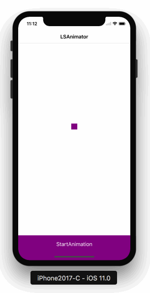
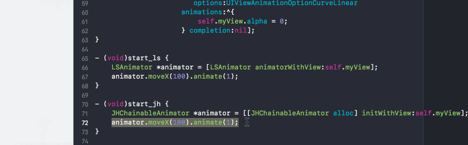
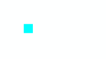
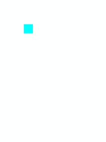
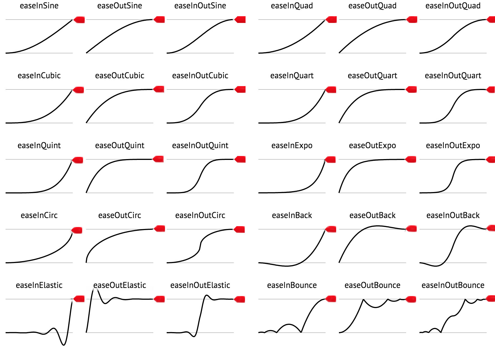

[](https://developer.apple.com/documentation/objectivec)&nbsp;
[](https://github.com/apple/swift)&nbsp;
[](http://cocoapods.org/pods/LSAnimator)&nbsp;
[](https://github.com/Carthage/Carthage)&nbsp;
[](https://travis-ci.org/Lision/LSAnimator)&nbsp;
[](https://raw.githubusercontent.com/Lision/LSAnimator/master/LICENSE)&nbsp;
[](http://cocoadocs.org/docsets/LSAnimator)&nbsp;
[](https://www.apple.com/nl/ios/)

# 为什么选择 LSAnimator？

通过使用 LSAnimator（Objective-C）或者 CoreAnimator（Swift）可以用少量的代码实现复杂而又易于维护的动画。

&nbsp;&nbsp;


# 什么是多链式动画？

CAAnimations 和 UIView animations 已经非常强大了，但是当动画设计稍微复杂一些时使用它们去实现会让代码变得非常难以阅读和维护。

假设我想用 spring 时间曲线将 myView 右移 100 点，移动完成之后再用 EaseIn 时间曲线将 myView 的宽度增加 30 点：

### 使用系统方法实现

``` obj-c
[UIView animateWithDuration:2.0
                          delay:0.0
         usingSpringWithDamping:0.8
          initialSpringVelocity:1.0
                        options:0
                     animations:^{
                         CGPoint newPosition = self.myView.frame.origin;
                         newPosition.x += 100;
                         self.myView.frame = CGRectMake(newPosition.x, newPosition.y, self.myView.frame.size.width, self.myView.frame.size.height);
                     } completion:^(BOOL finished) {
                         [UIView animateWithDuration:2.0
                                               delay:0.0
                                             options:UIViewAnimationOptionCurveEaseIn
                                          animations:^{
                                              CGSize newSize = self.myView.frame.size;
                                              newSize.width += 30;
                                              self.myView.frame = CGRectMake(self.myView.frame.origin.x, self.myView.frame.origin.y, newSize.width, newSize.height);
                                          } completion:nil];
                     }];
```

Emmmmm...这代码很难阅读，而且不利于维护。

嘛~ 用 LSAnimator 可以一行代码搞定。

### Using LSAnimator


``` obj-c
LSAnimator *animator = [LSAnimator animatorWithView:self.myView];
animator.moveX(100).spring.thenAfter(2).increWidth(30).easeIn.animate(2);
```

Emmmmm...不过已经有一个名为 JHChainableAnimations 的动画库了，使用它也可以做到这一点。

## 那么 JHChainableAnimations 存在哪些问题呢？

[JHChainableAnimations](https://github.com/jhurray/JHChainableAnimations) 具有强大的可链接式动画，并且语法易于读/写，但是它**不支持多链式动画**。

接着上面的例子，假设现在维持上面的动画需求不变，新加入需求要使 myView 的透明度在上面动画的**整个**执行过程中改为 0：

### LSAnimator


用 LSAnimator 实现的话仅需要添加一行代码即可。

``` obj-c
LSAnimator *animator = [LSAnimator animatorWithView:self.myView];
animator.moveX(100).spring.thenAfter(2).increWidth(30).easeIn.animate(2);
// Add this
animator.concurrent.makeOpacity(0).animate(4);
```

### JHChainableAnimations


Emmmmm...使用 JHChainableAnimations 是不能完成这项任务的。尝试添加下面的代码将会引起动画表现异常甚至闪退。效果就如上面所示，myView 闪了一下透明度直接变为了 0，这显然不是我们想要的效果。

``` obj-c
JHChainableAnimator *animator = [[JHChainableAnimator alloc] initWithView:self.myView];
animator.moveX(100).spring.thenAfter(2).moveWidth(30).easeIn.animate(2);
animator.makeOpacity(0).animate(4);
```

# LSAnimator VS JHChainableAnimations

- **多链式动画：** 可以实现几乎所有的动画设计，比 JHChainableAnimations 灵活而且强大（高了一个维度）。
- **支持 CALayer：** 支持通过 CALayer 初始化，可以直接操作 CALayer 实现动画, JHChainableAnimations 仅支持 UIView。
- **参数自动补全：** 支持参数自动补全，自动提示所需参数的数量和所属类型，JHChainableAnimations 并不支持。

LSAnimator 在 `.` 语法后跟出的方法中自带了参数提示，包含**参数的数量和所属类型**：


JHChainableAnimations 在 `.` 语法后跟出的方法并没有参数提示，使用起来很不方便，特别是不熟悉参数的时候需要 `command + left mouse` 跟代码才能确认所需参数的数量和类型：



不过 JHChainableAnimations 依然是一个很好的动画库（已经 3k+ Stars），LSAnimator 是站在 JHChainableAnimations 的肩膀上创建的，我准备持续维护有信心做的更好。

# 特性

- **支持 Swift：** 支持当前主流的 Swift 3.2 和 Swift 4.0。
- **友好的 Swift 接口：** 为了提供友好的 Swift 接口我加入了一个独立的 Framework 名为 CoreAnimator。
- **多链式动画：** 可以实现几乎所有的动画设计。
- **支持 CALayer：** 支持通过 CALayer 初始化，可以直接操作 CALayer 实现动画。
- **参数自动补全：** 支持参数自动补全，自动提示所需参数的数量和所属类型。
- **支持动画 Hooks：** 不仅在每个动画节点加入了 pre-animation 和 post-animation hooks 还为多链式动画加入了当所有动画链执行完毕后触发的 Hook。
- **非侵入性:** 不需要更改原有 UIView/CALayer 的继承类。

# 用法

### 创建一个 animator

LSAnimator 支持通过 UIView 和 CALayer 创建 animator，并提供类方法和 init 方法以供选择。

``` obj-c
// UIView initialization
LSAnimator *viewAnimator = [LSAnimator animatorWithView:self.myView];
LSAnimator *viewAnimator = [[LSAnimator alloc] initWithView:self.myView];

// CALayer initialization
LSAnimator *layerAnimator = [LSAnimator animatorWithLayer:self.myLayer];
LSAnimator *layerAnimator = [[LSAnimator alloc] initWithLayer:self.myLayer];
```

### 动画

可链式的属性比如 `moveX(x)` 必须居于 animator 与 `animate(t)` 方法之间。

下面的栗子🌰演示了如何在一秒钟内将 animator 绑定的对象 size 加倍的示例。

``` obj-c
animator.makeScale(2.0).animate(1.0);
```



### 动画结合

如果你想要在改变 scale 的同时移动 animator 绑定的对象，需要加入另一个可链式属性（次序并不重要）。

``` obj-c
animator.makeScale(2.0).moveXY(100, 50).animate(1.0);
// the same as animator.moveXY(100, 50).makeScale(2.0).animate(1.0);
```


> Note: 动画结合本质上是把两个需要同时执行且动画持续时长相同的可以放入同一动画节点的动画用 CAAnimationGroup 集结在一起，也仅仅适用于这种情况。

如果动画有不同的持续时长，或者动画设计出的需求本身就不能将动画放到同一节点实现则必须使用多链式动画，即 LSAnimator。相信我，这样的动画需求并不少见。

> 栗子🌰：如最开始的透明度场景，其实不难理解，比如穿外套下楼本身就是两件不相关的事，我什么时候穿好外套不一定要和下楼这个过程同一，我可以下楼到一半就穿好，也可能下完楼还是没穿好...

[这里](#chainable-properties) 可以找到完整的可链接属性列表.

### 链接动画

需要使用 `thenAfter(t)` 方法来分隔动画链上的动画节点。

下面的例子🌰演示了如何先缩放对象 0.5s 之后再移动对象 1s 的示例。

``` obj-c
animator.makeScale(2.0).thenAfter(0.5).moveXY(100, 50).animate(1.0);
```


### 动画效果

动画效果也可以理解为当前动画节点的动画时间曲线，需要在链式动画属性方法调用之后调用动画效果方法。

下面的例子🌰演示了用 spring 效果缩放一个视图的示例。

``` obj-c
animator.makeScale(2.0).spring.animate(1.0);
```


如果你在同一动画节点调用两个动画效果的话，后面调用的动画效果会覆盖掉前面的，即前面调用的动画效果不生效。

``` obj-c
animator.makeScale(2.0).bounce.spring.animate(1.0);
// The same as animator.makeScale(2.0).spring.animate(1.0);
```

[这里](#animation-effects-1) 可以找到动画效果属性的完整列表。

### 锚点

如果需要改变将 view/layer 的锚点，需要使用 achoring 方法，使用效果类似于上面提到的动画效果，当在同一动画节点调用另一个 achoring 方法会覆盖之前调用的 achoring 方法，即之前调用的 achoring 方法未生效。

下面的例子🌰演示了围绕不同的锚点旋转视图的示例。

``` obj-c
animator.rotateZ(180).anchorTopLeft.thenAfter(1.0).rotateZ(90).anchorCenter.animate(1.0);
// animator.rotateZ(90).anchorTopLeft.anchorCenter == animator.rotateZ(90).anchorCenter
```


[这里](#anchoring-1) 可以找到完整的锚点改变属性方法列表。

### 延时

可以通过调用 `wait(t)` 或 `delay(t)` 链式属性方法来延时动画的执行。

下面的例子🌰演示了如何延时 0.5s 之后移动 view 的示例。

Below is an example of moving a view after a delay of 0.5 seconds.

``` obj-c
animator.moveXY(100, 50).wait(0.5).animate(1.0);
// The same as animator.moveXY(100, 50).delay(0.5).animate(1.0);
```

### 完成

要在动画完成后运行代码，请调用 `animateWithCompletion（t，completion）*` 函数。

``` obj-c
animator.makeX(0).animateWithCompletion(1.0, ^{
	NSLog(@"Animation Done");
});
```

### 重复动画

可以通过调用 `repeat(time, count)` 替换 `thenAfter(time)` 的方式重复加入当前动画节点定义过的动画。

``` obj-c
animator.increWidth(30).spring.repeat(0.5, 3).moveXY(100, 50).animate(1.0);
```


如果要重复加入的动画时一条动画链的尾动画节点，可以调用 `animateWithRepeat(time, count)` 方法。

``` obj-c
animator.increWidth(30).spring.animateWithRepeat(0.5, 3);
```


### 回调

可以通过调用 `preAnimationBlock(block)` 和 `postAnimationBlock(block)` 方法实现对动画节点的 Hook。它们都需要提供一个简单的 `void(^block)(void)` 作为参数调用。在动画链中调用这些 Hook 方法的顺序无关紧要。

``` obj-c
animator.moveX(10).preAnimationBlock(^{
    NSLog(@"before the first animation");
}).thenAfter(1.0).postAnimationBlock(^{
    NSLog(@"After the second animation");
}).moveY(10).animate(1.0);
```

### 贝塞尔曲线

可以创建一个 `UIBezierPath *` 实例，然后添加点、线或者曲线对 view 的轨迹做贝塞尔曲线描述。

``` obj-c
UIBezierPath *path = [UIBezierPath bezierPath];
[path moveToPoint:self.myView.center];
[path addLineToPoint:CGPointMake(25, 400)];
[path addLineToPoint:CGPointMake(300, 500)];
animator.moveOnPath(path).animate(1.0);
```



## 与自动布局一起使用

### Transforms

需要使用 **transform** 可链式属性，因为这些属性更适合 Autolayout 的限制。注意不要混入其他的可链式动画属性。

``` obj-c
animatorForViewWithConstraints.transformX(50).transformScale(2).animate(1.0);
```

## 在 Swift 中使用

在现在的版本 2.x 中支持以 [Swift](https://developer.apple.com/swift/) 的形式使用 LSAnimator。我新建了一个独立的 Framework 以便给 Swift 更友好的使用体验，名字叫做 `CoreAnimator`，它基于 `LSAnimator` 上的简单封装，提供对于 Swift 更优雅的接口。

``` swift
let animator = CoreAnimator(view: myView)
animator.move(x: 60).thenAfter(t: 1.0).rotate(angle: 360).bounce.animate(t: 1.0)
```


## 可链式动画属性

``` obj-c
#pragma mark - Animations
// Makes
// Affects views position and bounds
@property (nonatomic, copy, readonly) LSAnimatorRect makeFrame;
@property (nonatomic, copy, readonly) LSAnimatorRect makeBounds;
@property (nonatomic, copy, readonly) LSAnimatorSize makeSize;
@property (nonatomic, copy, readonly) LSAnimatorPoint makeOrigin;
@property (nonatomic, copy, readonly) LSAnimatorPoint makePosition;
@property (nonatomic, copy, readonly) LSAnimatorFloat makeX;
@property (nonatomic, copy, readonly) LSAnimatorFloat makeY;
@property (nonatomic, copy, readonly) LSAnimatorFloat makeWidth;
@property (nonatomic, copy, readonly) LSAnimatorFloat makeHeight;
@property (nonatomic, copy, readonly) LSAnimatorFloat makeOpacity;
@property (nonatomic, copy, readonly) LSAnimatorColor makeBackground;
@property (nonatomic, copy, readonly) LSAnimatorColor makeBorderColor;
@property (nonatomic, copy, readonly) LSAnimatorFloat makeBorderWidth;
@property (nonatomic, copy, readonly) LSAnimatorFloat makeCornerRadius;
@property (nonatomic, copy, readonly) LSAnimatorFloat makeScale;
@property (nonatomic, copy, readonly) LSAnimatorFloat makeScaleX;
@property (nonatomic, copy, readonly) LSAnimatorFloat makeScaleY;
@property (nonatomic, copy, readonly) LSAnimatorPoint makeAnchor;

// Moves
// Affects views position and bounds
@property (nonatomic, copy, readonly) LSAnimatorFloat moveX;
@property (nonatomic, copy, readonly) LSAnimatorFloat moveY;
@property (nonatomic, copy, readonly) LSAnimatorPoint moveXY;
@property (nonatomic, copy, readonly) LSAnimatorPolarCoordinate movePolar;

// Increments
// Affects views position and bounds
@property (nonatomic, copy, readonly) LSAnimatorFloat increWidth;
@property (nonatomic, copy, readonly) LSAnimatorFloat increHeight;
@property (nonatomic, copy, readonly) LSAnimatorSize increSize;

// Transforms
// Affects views transform property NOT position and bounds
// These should be used for AutoLayout
// These should NOT be mixed with properties that affect position and bounds
- (LSAnimator *)transformIdentity;
@property (nonatomic, copy, readonly) LSAnimatorDegrees rotate; // Same as rotateZ
@property (nonatomic, copy, readonly) LSAnimatorDegrees rotateX;
@property (nonatomic, copy, readonly) LSAnimatorDegrees rotateY;
@property (nonatomic, copy, readonly) LSAnimatorDegrees rotateZ;
@property (nonatomic, copy, readonly) LSAnimatorFloat transformX;
@property (nonatomic, copy, readonly) LSAnimatorFloat transformY;
@property (nonatomic, copy, readonly) LSAnimatorFloat transformZ;
@property (nonatomic, copy, readonly) LSAnimatorPoint transformXY;
@property (nonatomic, copy, readonly) LSAnimatorFloat transformScale; // x and y equal
@property (nonatomic, copy, readonly) LSAnimatorFloat transformScaleX;
@property (nonatomic, copy, readonly) LSAnimatorFloat transformScaleY;


#pragma mark - Bezier Paths
// Animation effects dont apply
@property (nonatomic, copy, readonly) LSAnimatorBezierPath moveOnPath;
@property (nonatomic, copy, readonly) LSAnimatorBezierPath moveAndRotateOnPath;
@property (nonatomic, copy, readonly) LSAnimatorBezierPath moveAndReverseRotateOnPath;
```

## 动画效果

``` obj-c
- (LSAnimator *)easeIn;
- (LSAnimator *)easeOut;
- (LSAnimator *)easeInOut;
- (LSAnimator *)easeBack;
- (LSAnimator *)spring;
- (LSAnimator *)bounce;
- (LSAnimator *)easeInQuad;
- (LSAnimator *)easeOutQuad;
- (LSAnimator *)easeInOutQuad;
- (LSAnimator *)easeInCubic;
- (LSAnimator *)easeOutCubic;
- (LSAnimator *)easeInOutCubic;
- (LSAnimator *)easeInQuart;
- (LSAnimator *)easeOutQuart;
- (LSAnimator *)easeInOutQuart;
- (LSAnimator *)easeInQuint;
- (LSAnimator *)easeOutQuint;
- (LSAnimator *)easeInOutQuint;
- (LSAnimator *)easeInSine;
- (LSAnimator *)easeOutSine;
- (LSAnimator *)easeInOutSine;
- (LSAnimator *)easeInExpo;
- (LSAnimator *)easeOutExpo;
- (LSAnimator *)easeInOutExpo;
- (LSAnimator *)easeInCirc;
- (LSAnimator *)easeOutCirc;
- (LSAnimator *)easeInOutCirc;
- (LSAnimator *)easeInElastic;
- (LSAnimator *)easeOutElastic;
- (LSAnimator *)easeInOutElastic;
- (LSAnimator *)easeInBack;
- (LSAnimator *)easeOutBack;
- (LSAnimator *)easeInOutBack;
- (LSAnimator *)easeInBounce;
- (LSAnimator *)easeOutBounce;
- (LSAnimator *)easeInOutBounce;
```



[这里](http://easings.net/) 可以快速查看到这些动画效果的时间曲线。

这些动画功能是从一个很酷的 [关键帧动画库](https://github.com/NachoSoto/NSBKeyframeAnimation) 中找到的。

它们是基于 JQuery 的 [easing](http://gsgd.co.uk/sandbox/jquery/easing/jquery.easing.1.3.js) 函数实现的。（http://gsgd.co.uk/sandbox/jquery/easing/jquery.easing.1.3.js）

## 锚点

``` obj-c
- (LSAnimator *)anchorDefault;
- (LSAnimator *)anchorCenter;
- (LSAnimator *)anchorTop;
- (LSAnimator *)anchorBottom;
- (LSAnimator *)anchorLeft;
- (LSAnimator *)anchorRight;
- (LSAnimator *)anchorTopLeft;
- (LSAnimator *)anchorTopRight;
- (LSAnimator *)anchorBottomLeft;
- (LSAnimator *)anchorBottomRight;
```

## 多链式动画

可以通过调用 `concurrency` 方法来添加一个崭新的动画链，它不会影响以前的动画链。

``` obj-c
animator.increWidth(20).spring.animateWithRepeat(0.5, 3);
animator.concurrent.makeBackground([UIColor orangeColor]).animate(1);
```


> Note：不要尝试在新的动画链中改变之前动画链会在统一时段内改变的动画属性。

如你所想，当两个链同时作用于同一 view/layer 并且想要同时操作同一动画属性肯定会引发冲突。

我暂时无法在语法上限制这样明显违背逻辑的使用，不过我可以确保不会引起崩溃。

``` obj-c
// Do not do this
animator.moveX(20).animate(1.0);
animator.concurrent.moveX(-20).animate(1.0);
```


## 待实现

- Constraint animator

# 安装

### Cocoapods

#### Objective-C

1. Add `pod 'LSAnimator', '~> 2.1.1'` to your Podfile.
2. Run `pod install` or `pod update`.
3. Add `#import <LSAnimator/LSAnimator.h>`.

#### Swift

1. Add `pod 'CoreAnimator', '~> 2.1.1'` to your Podfile.
2. Run `pod install` or `pod update`.
3. Add `import CoreAnimator`.

### Carthage

1. Add `github "Lision/LSAnimator" ~> 2.1.1` to your Cartfile.
2. Run `carthage update --platform ios`.

#### Objective-C

Add the `LSAnimator` framework to your project.

#### Swift

Add the `CoreAnimator` framework to your project.

### 手动安装

Either clone the repo and manually add the Files in [LSAnimator](https://github.com/Lision/LSAnimator/tree/master/LSAnimator)

# 系统要求

- LSAnimator requires `iOS 7.0+`.
- CoreAnimator requires `iOS 9.0+`.

# 联系我

- Email: lisionmail@gmail.com
- Sina: [@Lision](https://weibo.com/5071795354/profile)
- Twitter: [@Lision](https://twitter.com/LisionChat)

# 许可证

[](https://raw.githubusercontent.com/Lision/LSAnimator/master/LICENSE)

LSAnimator is provided under the MIT license. See LICENSE file for details.